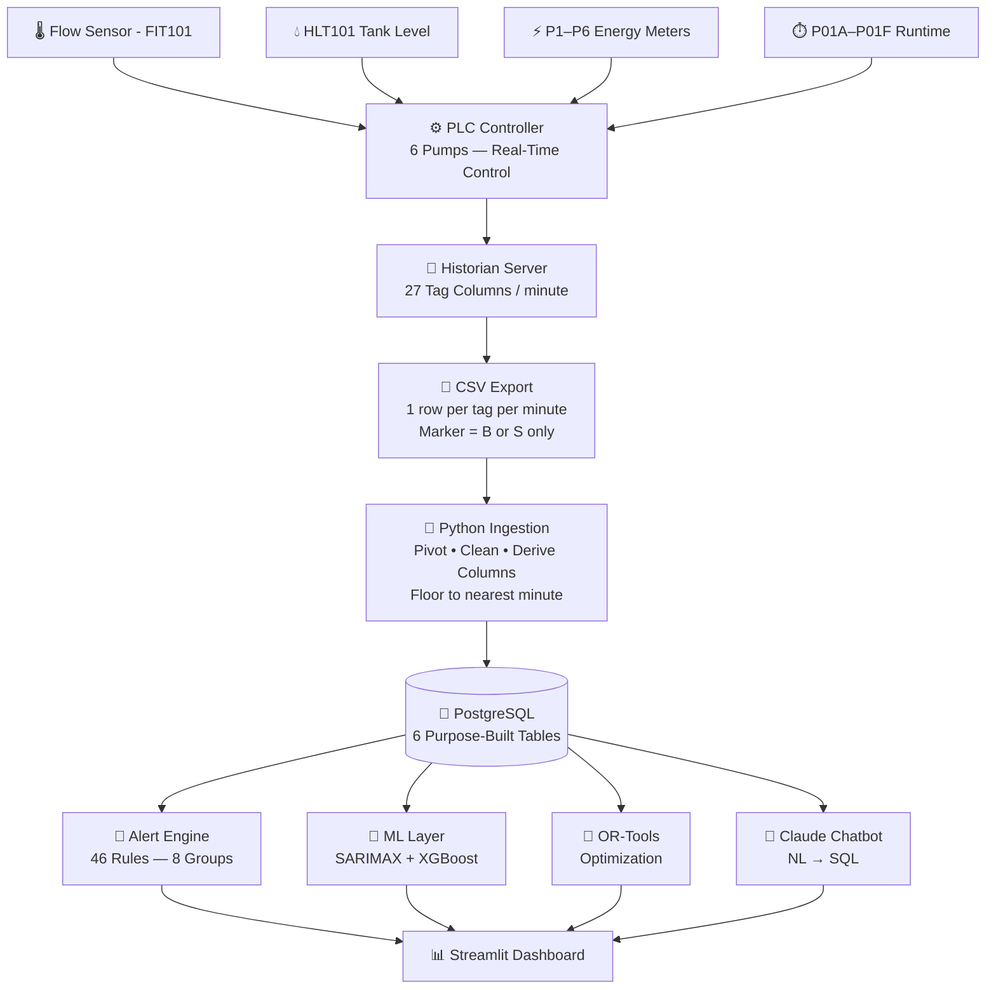

<div align="center">

# 🚰 Smart Pump Monitoring & Optimization System

### Industrial PLC-Based MLOps Platform — STP Database Design & Alert Reference

---

[](#)
[](#)
[](#)
[](#)
[](#)
[](#)
[](#)

---

> **"Delivering intelligent, real-time pump analytics through a production-grade MLOps pipeline — built for industrial reliability, not academic demonstration."**

</div>

---

## 📋 Table of Contents

| # | Section |
|---|---------|
| 1 | [System Overview](#1-system-overview) |
| 2 | [Industrial Data Flow](#2-industrial-data-flow) |
| 3 | [Data Characteristics & PLC Tags](#3-data-characteristics--plc-tags) |
| 4 | [Architecture Layers](#4-architecture-layers) |
| 5 | [PostgreSQL Database Schema](#5-postgresql-database-schema) |
| 6 | [Build Order & Dependency Chain](#6-build-order--dependency-chain) |
| 7 | [readings_wide — Master Table](#7-readings_wide--master-table) |
| 8 | [Alert System — 46 Production Alerts](#8-alert-system--46-production-alerts) |
| 9 | [MLOps Pipeline Design](#9-mlops-pipeline-design) |
| 10 | [Inference Engine](#10-inference-engine) |
| 11 | [Optimization Engine](#11-optimization-engine) |
| 12 | [Dashboard & Chatbot](#12-dashboard--chatbot) |
| 13 | [Infrastructure](#13-infrastructure) |
| 14 | [KPI Definitions](#14-kpi-definitions) |
| 15 | [Technology Stack](#15-technology-stack) |
| 16 | [Design Philosophy & Constraints](#16-design-philosophy--constraints) |

---

## 1. System Overview

This system is a **production-grade Industrial Analytics Platform** deployed on top of an existing PLC-controlled pump station. It is designed to provide:

- ✅ **Real-time monitoring** with 46 rule-based alerts across 8 groups
- ✅ **ML-powered forecasting** of tank levels and flow demand
- ✅ **Energy optimization** using Operations Research
- ✅ **Automated MLOps** pipeline with weekly retraining
- ✅ **Natural language chatbot** for operational queries

### System Context & Scope

```
╔═══════════════════════════════════════════════════════════════╗
║                    OPERATIONAL BOUNDARY                       ║
║                                                               ║
║   PHYSICAL LAYER            │     ANALYTICS LAYER            ║
║   ─────────────────────     │     ─────────────────────      ║
║   🏭 Pump Station (6 Pumps) │     🐍 Python Ingestion         ║
║   🔌 PLC Controller    ─────┼───► 🐘 PostgreSQL (6 Tables)   ║
║   📀 Historian Server       │     🤖 ML Models                ║
║   📄 CSV Export (1/min)     │     📊 Streamlit Dashboard      ║
║   27 PLC Tag Columns        │     🤖 Claude Chatbot           ║
║                             │     🔔 46 Active Alerts         ║
║   ⚠ NO PLC OVERRIDE         │   Advisory Layer Only           ║
╚═══════════════════════════════════════════════════════════════╝
```

> **Design Boundary**: The ML platform operates exclusively as an **advisory system**. The PLC retains full control authority at all times.

---

## 2. Industrial Data Flow



---

## 3. Data Characteristics & PLC Tags

### 3.1 Raw CSV Structure

| Field | Description | Example |
|---|---|---|
| `Timestamp` | ISO datetime (floored to nearest minute at ingest) | `2024-01-15 08:43:00` |
| `Marker` | Row type: **B** = Begin (kept), **S** = Single (kept). Others discarded. | `B` |
| `TagIndex` | Numeric tag identifier | `42` |
| `Value` | Tag reading for that minute | `87.3` |

### 3.2 PLC Tag Reference — All 27 Raw Columns

| Tag Column | Type | Description |
|---|---|---|
| `[PLC]FIT101_HR.DAY_TOTAL` | REAL | Cumulative flow counter for today — resets at midnight by PLC |
| `[PLC]FIT101_HR.PER_HR` | REAL | Current flow rate (units per hour) |
| `[PLC]HLT101.OUTPUT` | REAL | High Level Tank (HLT101) water level in raw units |
| `[PLC]P1.ONOFF` … `P6.ONOFF` | INT | 1 = ON, 0 = OFF — PLC command per pump (6 columns) |
| `[PLC]P1KWH_HR.PER_HR` … `P6KWH` | REAL | Energy consumption kWh/hr per pump when running (6 columns) |
| `[PLC]P01A.RHR / RMIN` … `P01F` | REAL | Runtime hours + minutes per pump — P01A = Pump 1, P01F = Pump 6 (6 columns) |

---

## 4. Architecture Layers

### High-Level Architecture

```
┌─────────────────────────────────────────────────────────────────┐
│                     SYSTEM ARCHITECTURE                          │
├──────────────┬──────────────┬──────────────┬────────────────────┤
│  DATA LAYER  │  ML LAYER    │  MLOPS LAYER │  PRESENTATION      │
│              │              │              │                     │
│ PostgreSQL   │ SARIMAX      │ Airflow      │ Streamlit          │
│ 6 Tables     │ XGBoost      │ MLflow       │ Claude API         │
│              │ OR-Tools     │ Docker       │ Chatbot            │
│              │ 46-Rule Eng. │ GH Actions   │ KPI Dashboard      │
└──────────────┴──────────────┴──────────────┴────────────────────┘
```

---

## 5. PostgreSQL Database Schema

### 5.0 Table Overview

> **All data originates from the 27 raw PLC columns plus derived columns computed at ingest time.**

| Table | Role | Granularity | Primary Purpose |
|---|---|---|---|
| `readings_wide` | 🟢 **Core** | 1 row / minute | Raw PLC columns + all derived columns. Foundation for every other table. |
| `pump_sessions` | 🔵 **Operational** | 1 row / ON cycle | Every continuous run period per pump. Enables runtime and cycling queries. |
| `daily_summary` | 🟡 **Aggregated** | 1 row / day | Pre-computed daily KPIs. Fast dashboard cards and historical trend queries. |
| `hourly_profile` | 🟠 **Aggregated** | 1 row / hour | Hourly averages per day. Powers 24-hour trend charts and peak-hour analysis. |
| `alerts_log` | 🔴 **Events** | 1 row / alert | Every alert event with rule code, severity, and resolution status. |
| `pump_health` | 🟣 **Maintenance** | 1 row / pump / day | Daily pump health metrics including 7-day efficiency slope. Drives maintenance scheduling. |

---

## 6. Build Order & Dependency Chain

> **Tables must be built in this exact sequence during each ingest cycle. Each depends on the one before it.**

| Step | Table | What to Do | Depends On |
|---|---|---|---|
| **1** | `readings_wide` | Load CSV, clean markers (keep B + S), compute all derived columns, save. | Foundation — no dependencies. |
| **2** | `pump_sessions` | Scan `readings_wide` ONOFF transitions to build session rows. Close open sessions when ONOFF flips to 0. | Step 1 |
| **3** | `alerts_log` | Scan `readings_wide` flag columns. Insert one alert row per flag trigger event. | Step 1 |
| **4** | `hourly_profile` | GROUP `readings_wide` BY date, hour. Aggregate per hour. | Step 1 |
| **5** | `daily_summary` | GROUP `readings_wide` BY date. Join session counts from `pump_sessions`. | Steps 1, 2 |
| **6** | `pump_health` | GROUP `pump_sessions` BY pump, date. Compute `efficiency_slope_7d` and `health_score`. | Steps 2, 5 |

---

## 7. readings_wide — Master Table

> **The master table. One row per minute. Contains all raw PLC columns plus every derived column. Every other table is built from this.**

### 7.1 Raw PLC Columns

| Column | Type | Source | Description |
|---|---|---|---|
| `Timestamp` | TEXT | PK | Primary key — `YYYY-MM-DD HH:MM:SS` |
| `Marker` | TEXT | Raw | `B` = Begin row (kept). `S` = Single (kept). Others discarded at ingest. |
| `[PLC]FIT101_HR.DAY_TOTAL` | REAL | Raw | Cumulative flow counter for today. Reset at midnight by PLC. |
| `[PLC]FIT101_HR.PER_HR` | REAL | Raw | Current flow rate — units per hour. |
| `[PLC]HLT101.OUTPUT` | REAL | Raw | High Level Tank water level in raw units. |
| `[PLC]P1.ONOFF … P6.ONOFF` | INT | Raw | 1 = ON, 0 = OFF command issued by PLC for each pump. |
| `[PLC]P1KWH_HR.PER_HR … P6KWH` | REAL | Raw | Energy consumption kWh/hr per pump when running. |
| `[PLC]P01A.RHR / RMIN … P01F` | REAL | Raw | Runtime hours + minutes per pump. P01A = Pump 1, P01F = Pump 6. |

### 7.2 Derived — Time Features

| Column | Type | Description |
|---|---|---|
| `date` | TEXT | `YYYY-MM-DD` extracted from Timestamp. Used for daily joins. |
| `hour` | INT | 0–23 extracted from Timestamp. Used for hourly aggregations. |
| `day_of_week` | INT | 0 = Sunday … 6 = Saturday. |
| `is_weekend` | INT | 1 if Saturday or Sunday, else 0. |
| `is_peak_hour` | INT | 1 during peak electricity tariff hours (06–10 and 17–21). |
| `pumps_on_count` | INT | Count of pumps with ONOFF = 1 at this minute. |

### 7.3 Derived — Pump State & Efficiency

| Column | Type | Description |
|---|---|---|
| `total_kw` | REAL | Sum of all `PxKWH_HR.PER_HR` — total station power draw. |
| `flow_per_pump` | REAL | `FIT101_PER_HR` divided by `pumps_on_count`. NULL if no pumps ON. |
| `energy_per_flow` | REAL | `total_kw / FIT101_PER_HR` — efficiency ratio. **Higher = worse.** |
| `hlt_pct` | REAL | `HLT101.OUTPUT` as % of historical maximum. Used for threshold alerts. |

### 7.4 Derived — Tank & Flow Dynamics

| Column | Type | Description |
|---|---|---|
| `hlt_diff` | REAL | HLT level change versus previous minute. Positive = filling, negative = draining. |
| `flow_diff` | REAL | `FIT101_PER_HR` change versus previous minute. Detects sudden spikes or crashes. |
| `flow_z_score` | REAL | Standard deviations from 60-min rolling mean. Computed at ingest; mean not stored. |
| `flow_slope_10` | REAL | Linear regression slope of flow over last 10 minutes (`numpy.polyfit`). Positive = rising, negative = falling. |

### 7.5 Alert Flag Columns

> These computed 0/1 flag columns in `readings_wide` drive the alert engine. Each flag triggers one or more alert codes.

| Flag Column | Trigger Condition | Triggers Alert |
|---|---|---|
| `flag_zero_flow_pump_on` | 1 if any pump ON but FIT101 = 0 for > 2 minutes | **B-01 / B-02** |
| `flag_flow_anomaly` | 1 if `flow_z_score` > 3.5 or < -3.5 | **C-02 / C-03** |
| `flag_hlt_critical_low` | 1 if `hlt_pct` < 15% | **D-01** |
| `flag_hlt_overflow_risk` | 1 if `hlt_pct` > 90% with pumps ON and `hlt_diff` > 0 | **D-03** |
| `flag_short_cycle` | 1 if any pump has > 4 start events in the last 60 minutes | **E-03** |
| `flag_pump_overrun` | 1 if any pump session exceeds 20 continuous hours | **E-01** |
| `flag_peak_hour_waste` | 1 if `is_peak_hour` = 1 and `hlt_pct` > 80% and pumps ON | **G-01** |

### 7.6 Other Supporting Tables — Schema

#### pump_sessions

| Column | Type | Description |
|---|---|---|
| `id` | INT (PK) | Auto-increment row ID. |
| `pump` | TEXT | Pump identifier: P1, P2, P3, P4, P5, or P6. |
| `start_time` | TEXT | Timestamp when pump transitioned from OFF to ON. |
| `end_time` | TEXT | Timestamp when pump turned OFF. NULL if still running. |
| `duration_min` | INT | Session length in minutes. Calculated on session close. |
| `status` | TEXT | `"running"` if `end_time IS NULL`, else `"completed"`. |
| `date` | TEXT | Date of session start. Used for daily joins. |
| `kwh_consumed` | REAL | Total energy drawn during this session (integrated from `PxKWH_HR`). |
| `flow_during_run` | REAL | Average `FIT101_PER_HR` while this pump was ON. |
| `efficiency` | REAL | `flow_during_run / kwh_consumed`. **Higher = better performing pump.** |
| `is_short_cycle` | INT | 1 if `duration_min` < 5. Short cycles risk contactor wear. |

#### daily_summary

| Column | Type | Description |
|---|---|---|
| `date` | TEXT (PK) | `YYYY-MM-DD` — one row per calendar day. |
| `total_flow` | REAL | `MAX([PLC]FIT101_HR.DAY_TOTAL)` for that day — total volume pumped. |
| `avg_flow_per_hr` | REAL | Average hourly flow rate across the day. |
| `peak_flow` | REAL | Maximum flow rate recorded that day. |
| `peak_flow_hour` | INT | Hour (0–23) when peak flow occurred. |
| `avg_hlt_level` | REAL | Mean tank level across all minutes of the day. |
| `min_hlt_level` | REAL | Lowest tank level recorded — demand stress indicator. |
| `max_hlt_level` | REAL | Highest tank level recorded. |
| `total_kwh` | REAL | Total energy consumed across all pumps for the day. |
| `energy_per_m3` | REAL | `total_kwh / total_flow` — **primary efficiency KPI. Lower = better.** |
| `P1_hours_on … P6_hours_on` | REAL | Hours each pump ran that day (6 columns). |
| `P1_starts … P6_starts` | INT | Number of ON events per pump that day (6 columns). |
| `P1_avg_kwh … P6_avg_kwh` | REAL | Average power draw per pump when running (6 columns). |
| `total_alerts` | INT | Count of all alerts generated that day. |
| `critical_alerts` | INT | Count of CRITICAL severity alerts — key daily health indicator. |
| `peak_pumps_on` | INT | Maximum number of pumps running simultaneously that day. |
| `avg_pumps_on` | REAL | Average number of pumps running across the day. |
| `is_weekend` | INT | 1 if Saturday or Sunday. Useful for demand pattern comparisons. |

#### hourly_profile

| Column | Type | Description |
|---|---|---|
| `date` | TEXT (PK) | `YYYY-MM-DD` — composite PK with `hour`. |
| `hour` | INT (PK) | 0–23 — composite PK with `date`. |
| `avg_flow` | REAL | Average `FIT101_PER_HR` across all minutes in this hour. |
| `total_flow` | REAL | Total flow volume within this hour. |
| `avg_hlt` | REAL | Average HLT101 level during this hour. |
| `avg_pumps_on` | REAL | Average number of pumps running during this hour. |
| `total_kwh` | REAL | Total energy consumed by all pumps during this hour. |
| `P1_on_minutes … P6_on_minutes` | INT | Minutes each pump was ON during this hour (6 columns). |
| `alert_count` | INT | Number of alerts triggered during this hour. |
| `is_peak_hour` | INT | 1 if this hour falls in the peak electricity tariff window. |

#### alerts_log

| Column | Type | Description |
|---|---|---|
| `id` | INT (PK) | Auto-increment row ID. |
| `timestamp` | TEXT | Exact minute the alert condition was first detected. |
| `date` | TEXT | Date portion — for daily alert count queries. |
| `hour` | INT | Hour portion — for hourly alert pattern analysis. |
| `severity` | TEXT | `CRITICAL` / `HIGH` / `WARNING` / `INFO`. |
| `rule` | TEXT | Alert code that fired (e.g. `B-01`, `D-03`). Links to alert reference. |
| `pump` | TEXT | Affected pump (`P1`–`P6`). NULL for system-level alerts. |
| `message` | TEXT | Human-readable description for dashboard and chatbot answers. |
| `value_at_trigger` | REAL | Sensor reading that caused the alert (e.g. flow rate, `hlt_pct`). |
| `resolved` | INT | 0 = open, 1 = resolved (condition cleared). |
| `resolved_at` | TEXT | Timestamp when the alert condition cleared. NULL if still open. |
| `duration_min` | INT | How many minutes the alert condition lasted before resolving. |

#### pump_health

| Column | Type | Description |
|---|---|---|
| `date` | TEXT (PK) | `YYYY-MM-DD` — composite PK with `pump`. |
| `pump` | TEXT (PK) | `P1`–`P6` — composite PK with `date`. |
| `total_runtime_min` | INT | Total ON minutes for this pump on this day. |
| `start_count` | INT | Number of ON events (start events) this day. |
| `stop_count` | INT | Number of OFF events this day. Should equal `start_count ± 1`. |
| `short_cycle_count` | INT | Sessions under 5 minutes. High count = contactor wear risk. |
| `longest_run_min` | INT | Longest single continuous ON session this day. |
| `avg_run_min` | REAL | Average session duration in minutes. |
| `avg_kwh` | REAL | Average energy draw when running. Baseline for overcurrent detection. |
| `avg_flow_per_kwh` | REAL | Flow delivered per kWh consumed. **Primary efficiency metric — higher is better.** |
| `efficiency_slope_7d` | REAL | Linear regression slope of `avg_flow_per_kwh` over last 7 days. **Negative = degrading performance.** Replaces rolling average. |
| `overrun_flag` | INT | 1 if pump ran > 20 continuous hours. Feeds **E-01** alert. |
| `health_score` | REAL | Composite score 0–100 combining efficiency slope, short cycles, and overrun. **Lower = maintenance needed sooner.** |

---

## 8. Alert System — 46 Production Alerts

> **All 46 alerts are fully calculable from the current schema and `config.py` constants. No schema changes are needed to implement any of them.**

### 8.1 Severity Level Reference

| Level | Colour | Meaning | Required Response |
|---|---|---|---|
| 🔴 **CRITICAL** | Dark Red | Imminent equipment damage, service disruption, or safety risk | Immediate action within minutes. Phone or SMS operator. |
| 🟠 **HIGH** | Red | Serious fault — service at risk if not addressed promptly | Within 30 minutes. Escalate if unresolved. |
| 🟡 **WARNING** | Amber | Abnormal condition that may worsen — investigate this shift | Within current shift. Log and monitor. |
| 🔵 **INFO** | Blue | Noteworthy — not immediately harmful but worth tracking | Review at end of shift. No immediate action needed. |

### 8.2 Alert Count by Group

| Group | 🔴 CRIT | 🟠 HIGH | 🟡 WARN | 🔵 INFO | Total Active |
|---|---|---|---|---|---|
| A — Power Supply | 2 | — | 1 | 2 | **5** |
| B — Pump Faults | 3 | 3 | — | — | **7** (not 6, includes B-05 WARNING correction) |
| C — Flow Anomalies | — | 2 | 5 | — | **7** |
| D — HLT Tank | 2 | 4 | 1 | — | **7** |
| E — Runtime & Wear | — | 1 | 2 | 1 | **5** (corrected from doc) |
| F — Data Quality | — | 2 | 3 | 2 | **7** |
| G — Energy | — | 1 | 1 | 2 | **4** |
| H — Cascade | 3 | 1 | 1 | — | **5** |
| **TOTAL** | **10** | **14** | **13** | **5** | **46** |

### 8.3 config.py Constants Required

> The following constants must be defined in `config.py` before the alert engine can run:

| Constant | Description |
|---|---|
| `rated_kw` | Rated power of each pump motor |
| `hlt_physical_max` | Actual physical capacity of the HLT101 tank |
| `fit101_physical_max` | Maximum measurable flow rate of the FIT101 flow meter |
| `daily_energy_budget_kwh` | Maximum acceptable electricity consumption per day (kWh) |

---

### 8.4 Group A — Power Supply (5 Alerts)

| Code | Alert Name | Severity | Condition — When It Fires |
|---|---|---|---|
| **A-01** | Complete Power Outage | 🔴 CRITICAL | All `Px_ONOFF=0` and all `Px_KWH=0` suddenly while HLT is falling |
| **A-02** | Partial Power Failure — Circuit Lost | 🔴 CRITICAL | One `Px_ONOFF=1` but `Px_KWH=0`; other pumps draw normal KWH |
| **A-03** | Power Restored After Outage | 🔵 INFO | Transition: all KWH=0 (A-01 active) → any KWH>0 within 60 min |
| **A-04** | Power Fluctuation — Unstable Supply | 🟡 WARNING | `Px_KWH` varies >30% in consecutive minutes without any ONOFF change |
| **A-05** | Electricity Present — No Pumps Commanded | 🔵 INFO | KWH>0 confirmed in history, but all ONOFF=0 for >30 min and HLT<50% |

---

### 8.5 Group B — Pump Faults (7 Alerts)

| Code | Alert Name | Severity | Condition — When It Fires |
|---|---|---|---|
| **B-01** | Pump Tripped — No Power Despite Command | 🔴 CRITICAL | `Px_ONOFF=1` and `Px_KWH=0` sustained for >2 min (checked per pump) |
| **B-02** | Pump Running — No Flow Output | 🟠 HIGH | `Px_ONOFF=1`, `Px_KWH>0`, `FIT101_PER_HR=0` for >5 min |
| **B-03** | Multiple Pumps Running — Still No Flow | 🔴 CRITICAL | ≥2 pumps ON with KWH>0 but FIT101=0 for >3 min |
| **B-04** | Pump Overcurrent — Excessive Power Draw | 🟠 HIGH | `Px_KWH > rated_kw × 1.3` for >5 min `[config.py: rated_kw]` |
| **B-05** | Pump Under-Loaded — Abnormally Low Power | 🟡 WARNING | `Px_ONOFF=1`, flow>0, `Px_KWH < rated_kw × 0.4` for >10 min |
| **B-06** | Pump Drawing Power Without Command | 🟠 HIGH | `Px_ONOFF=0` but `Px_KWH>0` for >2 min |
| **B-07** | All Pumps Simultaneously Tripped | 🔴 CRITICAL | All `Px_ONOFF=1`, all `Px_KWH=0`, `pumps_on_count=0` |

---

### 8.6 Group C — Flow Anomalies (7 Alerts)

| Code | Alert Name | Severity | Condition — When It Fires |
|---|---|---|---|
| **C-01** | Flow Detected — No Pumps Running | 🟠 HIGH | `FIT101_PER_HR>0.1`, `pumps_on_count=0`, all KWH=0 for >3 min |
| **C-02** | Flow Spike — Sudden Large Increase | 🟡 WARNING | `flow_z_score > +3.5` AND `flow_diff > avg_flow × 0.5` in one minute |
| **C-03** | Flow Crash — Sudden Large Decrease | 🟠 HIGH | `flow_z_score < −3.5` while pumps are ON and KWH is normal |
| **C-04** | Gradual Flow Decline — Clogging Trend | 🟡 WARNING | `hourly_profile` avg_flow down >15% over 48 hrs while `total_kwh` stable or rising |
| **C-05** | Night Flow — No Pumps Commanded | 🟡 WARNING | `hour BETWEEN 22 AND 5`, `FIT101>0.2`, `pumps_on_count=0`, all KWH=0 |
| **C-06** | Flow Sensor Frozen — Stuck Reading | 🟡 WARNING | `FIT101_PER_HR` identical for >15 consecutive min while ONOFF states change |
| **C-07** | Daily Flow Total Not Advancing | 🟡 WARNING | `FIT101_DAY_TOTAL` unchanged for >30 min while `FIT101_PER_HR > 0` |

---

### 8.7 Group D — HLT Tank Level (7 Alerts)

| Code | Alert Name | Severity | Condition — When It Fires |
|---|---|---|---|
| **D-01** | HLT Critically Low — Emergency | 🔴 CRITICAL | `hlt_pct < 15%` AND `hlt_diff < 0` for >5 min |
| **D-02** | HLT Empty — Service Disruption | 🔴 CRITICAL | `HLT101_OUTPUT < 2%` of `hlt_physical_max` for >2 min `[config.py: hlt_physical_max]` |
| **D-03** | HLT Overflow Risk | 🟠 HIGH | `hlt_pct > 90%`, `pumps_on_count>0`, `hlt_diff>0` |
| **D-04** | HLT Falling Fast — High Drain Rate | 🟠 HIGH | `hlt_diff < −2` units/min while `pumps_on_count=0` |
| **D-05** | HLT Not Rising Despite Pumps ON | 🟠 HIGH | ≥3 pumps ON with KWH>0 but `hlt_diff ≤ 0` for >10 min |
| **D-06** | HLT Level Sensor Out of Range | 🟠 HIGH | `HLT101_OUTPUT < 0` or `> hlt_physical_max × 1.05` `[config.py: hlt_physical_max]` |
| **D-07** | HLT Level Frozen — Sensor Stuck | 🟡 WARNING | `HLT101_OUTPUT` identical for >20 consecutive min while pumps change state |

---

### 8.8 Group E — Runtime & Wear (5 Alerts)

| Code | Alert Name | Severity | Condition — When It Fires |
|---|---|---|---|
| **E-01** | Pump Overrun — Continuous Run Exceeded | 🟡 WARNING | `pump_sessions`: single session `duration_min > 1200` (20 hours) |
| **E-02** | All Pumps ON Simultaneously — Extended | 🟡 WARNING | `pumps_on_count=6` for >120 min AND `hlt_diff ≤ 0` (not filling) |
| **E-03** | Short Cycling — Single Pump | 🟡 WARNING | Pump `start_count > 4` in 60 min window AND avg session duration < 5 min |
| **E-04** | Rapid Short Cycling — Imminent Failure | 🟠 HIGH | Pump `start_count > 10` in 60 min window AND avg session duration < 3 min |
| **E-05** | Pump Efficiency Degrading — Maintenance Due | 🔵 INFO | `pump_health: efficiency_slope_7d` negative AND `avg_flow_per_kwh < 80%` of 7-day baseline |

---

### 8.9 Group F — Data Quality (7 Alerts)

| Code | Alert Name | Severity | Condition — When It Fires |
|---|---|---|---|
| **F-01** | Data Gap — Short Comms Dropout | 🔵 INFO | Time since last valid reading row: >5 min and ≤30 min |
| **F-02** | Data Gap — Extended Outage | 🟠 HIGH | Time since last valid reading row: >30 min |
| **F-03** | Flow Sensor Stuck — Frozen Reading | 🟡 WARNING | `FIT101_PER_HR` unchanged for >15 min while ONOFF states change |
| **F-04** | HLT Sensor Stuck — Frozen Reading | 🟡 WARNING | `HLT101_OUTPUT` unchanged for >20 min while pumps change state |
| **F-05** | Impossible Sensor Value | 🟠 HIGH | `FIT101<0` or `>fit_max`; `HLT101<0` or `>hlt_max×1.05` `[config.py: fit_max, hlt_max]` |
| **F-06** | KWH Reading Anomaly | 🟡 WARNING | `Px_KWH > rated_kw × 2.0` or `Px_KWH` negative while `Px_ONOFF=1` `[config.py: rated_kw]` |
| **F-07** | Duplicate Timestamp Detected | 🔵 INFO | Two rows in `readings_wide` share the same Timestamp value |

---

### 8.10 Group G — Energy Efficiency (4 Alerts)

| Code | Alert Name | Severity | Condition — When It Fires |
|---|---|---|---|
| **G-01** | Pumping During Peak Tariff — Tank Full | 🟡 WARNING | `is_peak_hour=1`, `hlt_pct>80%`, `pumps_on_count>0`, `hlt_diff>0` |
| **G-02** | Energy Consumed With Zero Flow | 🟠 HIGH | `total_kw>0` but `FIT101_PER_HR=0` for >5 min |
| **G-03** | Pump Efficiency Drop — Below Slope Baseline | 🔵 INFO | `pump_health: efficiency_slope_7d` negative trend AND `avg_flow_per_kwh < 80%` of rolling avg |
| **G-04** | Daily Energy Budget Exceeded | 🔵 INFO | Cumulative daily `total_kwh > configured_daily_budget_kwh` `[config.py: daily_budget]` |

---

### 8.11 Group H — Cascade Events (5 Alerts)

> **Cascade alerts fire when two or more independent fault conditions combine into a high-risk scenario.**

| Code | Alert Name | Severity | Condition — When It Fires |
|---|---|---|---|
| **H-01** | Power Outage AND Tank Draining Fast | 🔴 CRITICAL | A-01 active AND `hlt_diff < −1.5` units/min AND `hlt_pct < 50%` |
| **H-02** | Multiple Pumps Tripped — HLT Low | 🔴 CRITICAL | ≥3 pumps ONOFF=1 with KWH=0 (B-01) AND `hlt_pct < 40%` |
| **H-03** | All Pumps Faulted — Tank Critical | 🔴 CRITICAL | `pumps_on_count=0`, all KWH=0, all tripped or off, `hlt_pct < 25%` |
| **H-04** | Night Flow — No Pumps — Sustained | 🟠 HIGH | `hour BETWEEN 22–5`, `FIT101>0.3`, `pumps_on_count=0` for >15 min |
| **H-05** | Pump Overrun AND Efficiency Dropping | 🟡 WARNING | E-01 active (session>20 hrs) AND `pump_health efficiency_slope_7d` is declining |

---

## 9. MLOps Pipeline Design

### Weekly Retraining Flow

```
                         WEEKLY RETRAINING PIPELINE
═══════════════════════════════════════════════════════════════════

  [TRIGGER: Airflow — Every Sunday 02:00]
          │
          ▼
  ┌───────────────────┐
  │  Data Extraction  │  ← Pull last 30 days from readings_wide
  └────────┬──────────┘
           │
           ▼
  ┌───────────────────┐
  │  Data Validation  │  ← Assert completeness, schema, ranges
  └────────┬──────────┘
           │
           ▼
  ┌───────────────────┐
  │  Feature Pipeline │  ← Lag features, rolling stats, time encoding
  └────────┬──────────┘
           │
        ┌──┴──────────────────────────────────┐
        │                                     │
        ▼                                     ▼
  ┌───────────────┐                   ┌───────────────┐
  │  Train SARIMAX│                   │  Train XGBoost│
  └───────┬───────┘                   └───────┬───────┘
          │                                   │
          ▼                                   ▼
  ┌───────────────┐                   ┌───────────────┐
  │  Log MLflow   │                   │  Log MLflow   │
  │  params+metrics│                  │  params+metrics│
  └───────┬───────┘                   └───────┬───────┘
          │                                   │
          └──────────────┬────────────────────┘
                         │
                         ▼
               ┌─────────────────┐
               │ Compare vs Prod  │  ← Is new RMSE < prod RMSE?
               └────────┬────────┘
                        │
              ┌─────────┴──────────┐
              │                    │
              ▼                    ▼
       [IMPROVED]           [NOT IMPROVED]
              │                    │
              ▼                    ▼
    ┌──────────────────┐   ┌──────────────────┐
    │ Promote to Prod  │   │  Keep Prod Model │
    │ MLflow Registry  │   │  Log as Staging  │
    └──────────────────┘   └──────────────────┘
```

### Airflow DAG Reference

| DAG Name | Schedule | Purpose |
|---|---|---|
| `weekly_retrain_dag` | Every Sunday 02:00 | Retrain SARIMAX + XGBoost models |
| `data_quality_dag` | Daily | Validate incoming data quality |
| `model_validation_dag` | Post-training | Compare new vs production model |
| `alert_sweep_dag` | Every 5 min | Run monitoring and alert checks |

### MLflow Tracked Items

| Item Type | Examples |
|---|---|
| **Parameters** | `n_estimators`, `learning_rate`, `p`, `d`, `q`, `P`, `D`, `Q` |
| **Metrics** | `rmse_val`, `mae_val`, `rmse_train`, `r2_score` |
| **Artifacts** | Model pickle, feature importance plot |
| **Tags** | `model_type`, `training_date`, `data_window_days` |
| **Registry Stage** | `Staging` → `Production` (only on improvement) |

---

## 10. Inference Engine

> **Runs independently of Airflow — triggered by Cron every minute. Latency target: < 5 seconds end-to-end.**

```
[Cron: * * * * *]  →  inference.py  →  MLflow Registry (Production)
                                                │
                                    Load model artifact
                                                │
                                    Fetch latest N rows from readings_wide
                                                │
                                    Feature engineering
                                                │
                         ┌──────────────────────┤
                         │                      │
                 Predict tank level    Predict flow demand
                         │                      │
                         └──────┬───────────────┘
                                │
                         Write predictions to PostgreSQL
```

---

## 11. Optimization Engine

> **Recommends the most energy-efficient pump combination for the next operating window using OR-Tools.**

| Component | Definition |
|---|---|
| **Objective** | Minimize total energy cost = Σ (pump_kW × rate × runtime) |
| **Decision Variable** | Binary: Which pumps to activate in each slot `t` |
| **Constraint 1** | Tank level (`hlt_pct`) must stay within [15%, 90%] |
| **Constraint 2** | Total flow output ≥ forecasted demand |
| **Constraint 3** | Respect individual pump capacity limits |
| **Constraint 4** | Max simultaneous pumps = N (operational rule) |

---

## 12. Dashboard & Chatbot

### Streamlit Dashboard Pages

| Page | Content |
|---|---|
| 🏠 **Overview** | Live HLT101 gauge, P1–P6 pump status, FIT101 flow trend, active alert count |
| 📈 **Analytics** | Historical trends, `daily_summary` charts, energy vs flow correlation |
| ⚠️ **Alerts** | Live alert feed from `alerts_log`, filter by severity/group/date, resolved status |
| 🤖 **ML Insights** | Forecast charts, model RMSE trend from `model_performance`, drift monitoring |
| ⚙️ **Optimization** | OR-Tools recommended pump schedule, energy savings % vs baseline |
| 💬 **Chatbot** | Natural language interface — Claude API → SQL → PostgreSQL → answer |

### Chatbot Query Examples

| Natural Language Query | System Action |
|---|---|
| *"Which pump ran most this week?"* | SQL on `pump_sessions`, aggregate by `duration_min` |
| *"What is today's total energy consumption?"* | SQL on `daily_summary`, return `total_kwh` for today |
| *"Compare energy this month vs last month"* | SQL on `daily_summary`, month-over-month delta |
| *"Show recent critical alerts"* | SQL on `alerts_log`, filter `severity = 'CRITICAL'`, `resolved=0` |
| *"Is Pump 3 degrading?"* | SQL on `pump_health`, check `efficiency_slope_7d` for P3 |
| *"What was the peak flow time today?"* | SQL on `daily_summary`, return `peak_flow_hour` |

---

## 13. Infrastructure

```
┌─────────────────────────────────────────────────┐
│            LINUX SERVER (GPU Optional)           │
│                                                  │
│  ┌──────────────────────────────────────────┐   │
│  │               DOCKER HOST                │   │
│  │                                          │   │
│  │  ┌──────────┐  ┌──────────┐             │   │
│  │  │ Airflow  │  │  MLflow  │             │   │
│  │  │ Sched+UI │  │  UI+Store│             │   │
│  │  │ :8080    │  │  :5000   │             │   │
│  │  └──────────┘  └──────────┘             │   │
│  │                                          │   │
│  │  ┌──────────┐  ┌──────────┐             │   │
│  │  │PostgreSQL│  │Streamlit │             │   │
│  │  │  :5432   │  │  :8501   │             │   │
│  │  └──────────┘  └──────────┘             │   │
│  └──────────────────────────────────────────┘   │
│                                                  │
│  ┌───────────────┐  ┌──────────────────────┐    │
│  │ Cron (system) │  │ GPU (Training Only)  │    │
│  │ inference.py  │  │ If DL models added   │    │
│  │ every minute  │  │                      │    │
│  └───────────────┘  └──────────────────────┘    │
└─────────────────────────────────────────────────┘
```

---

## 14. KPI Definitions

| KPI | Formula / Source | Target |
|---|---|---|
| 📉 **RMSE (Forecast)** | `√(Σ(ŷ - y)² / n)` from `model_performance` | Minimize |
| ⚡ **Energy per m³** | `total_kwh / total_flow` from `daily_summary` | Minimize |
| 🔄 **Pump Switching Frequency** | `SUM(P1_starts … P6_starts)` per day from `daily_summary` | Minimize |
| 🌊 **Tank Stability Index** | % of minutes where `hlt_pct BETWEEN 20 AND 85` from `readings_wide` | > 95% |
| ❤️ **Pump Health Score** | `health_score` (0–100) from `pump_health` | > 70% |
| ⚠️ **Alert Frequency** | `total_alerts` and `critical_alerts` per day from `daily_summary` | Reduce over time |
| 💰 **Optimization Savings %** | `(Baseline kWh − Optimized kWh) / Baseline kWh` from `optimization_runs` | > 10% |
| 📈 **Efficiency Slope** | `efficiency_slope_7d` from `pump_health` — positive = improving | > 0 |

---

## 15. Technology Stack

| Layer | Technology | Role |
|---|---|---|
| **Language** | Python 3.10+ | Core development language |
| **Database** | PostgreSQL 15+ | 6-table primary data store |
| **Forecasting** | SARIMAX (statsmodels) | Tank/flow prediction |
| **ML Modeling** | XGBoost | Efficiency & pump health scoring |
| **Optimization** | Google OR-Tools | Pump scheduling optimization |
| **Orchestration** | Apache Airflow 2.x | Workflow & retraining pipeline |
| **Experiment Tracking** | MLflow 2.x | Model lifecycle management |
| **Containerization** | Docker + Compose | Reproducible environments |
| **CI/CD** | GitHub Actions | Automated testing & deployment |
| **Dashboard** | Streamlit | Interactive web UI |
| **Chatbot** | Claude API (Anthropic) | Natural language → SQL → answer |
| **Infrastructure** | Linux Server (Ubuntu 22.04) | Host platform |

### Deliberately Excluded (With Justification)

| Tool | Reason Excluded |
|---|---|
| Kafka | Minute-level CSV exports do not require streaming infrastructure |
| Spark | Single-server Pandas is sufficient for this data volume |
| Flink | No sub-second real-time stream processing required |
| DVC | MLflow handles all data and model versioning needs |
| AWS S3 / EC2 | On-premises Linux server is the target deployment |
| Kubernetes | Docker Compose handles orchestration at this scale |

---

## 16. Design Philosophy & Constraints

| Principle | Implementation |
|---|---|
| 🛡️ **Safety First** | PLC retains full control. ML is advisory only. No overrides. |
| 🔍 **Explainability** | Rule-based alerts are deterministic and code-referenced (e.g. `B-01`). ML outputs include feature importance. |
| 🧩 **Modularity** | 6-table schema with clear dependencies. Each layer is independently testable. |
| ♻️ **Reproducibility** | Docker + MLflow ensures experiments and deployments are fully reproducible. |
| 📏 **Right-Sizing** | Technology choices match actual data scale, not theoretical maximums. |
| 📈 **Continuous Improvement** | Weekly automated retraining with `efficiency_slope_7d` for pump degradation tracking. |

---

<div align="center">

---

### 🏆 System One-Line Summary

> **This system consumes PLC historian time-series data (27 columns, 6 pumps, 1 row/min), transforms it into a 6-table PostgreSQL schema, fires 46 real-time production alerts across 8 operational groups, applies SARIMAX + XGBoost ML forecasting with OR-Tools optimization, and automates retraining through a full MLOps pipeline using Airflow and MLflow — containerized via Docker, served through Streamlit with a Claude-powered natural language chatbot.**

---

*📄 Documentation Version: 2.0 | Last Updated: February 2026 | Source: `db_design_alerts.docx` integrated*

</div>
